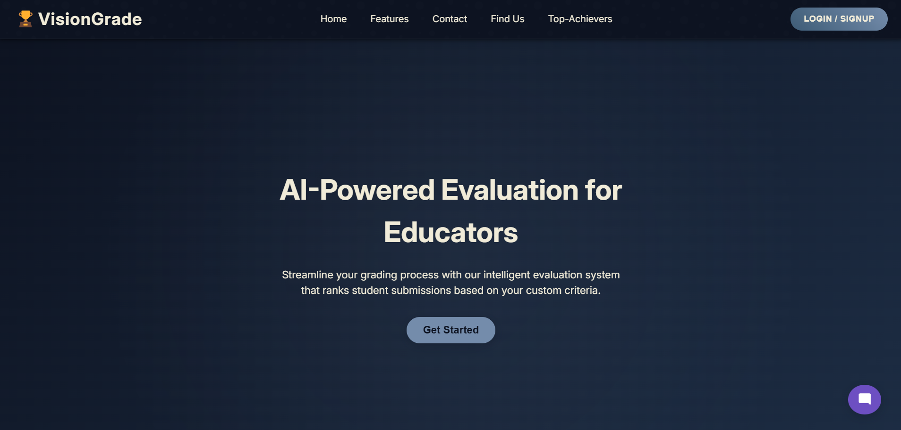

# 🎯 VisionGrade - AI-Powered Assessment Platform

<div align="center">

[](https://github.com/satwikkaushik/Team10-HackLens-VisionGrade)
[](https://github.com/satwikkaushik/Team10-HackLens-VisionGrade)
[](https://github.com/satwikkaushik/Team10-HackLens-VisionGrade)
[](https://github.com/satwikkaushik/Team10-HackLens-VisionGrade)

</div>

## 🚀 Overview

VisionGrade is a cutting-edge, AI-powered assessment platform designed to revolutionize the evaluation process for educational institutions and hackathon organizations. By leveraging advanced Language Learning Models (LLMs), VisionGrade provides automated, consistent, and scalable evaluation capabilities for various types of submissions including code, mathematics, and science projects.

## ✨ Key Features

### 🤖 Intelligent Assessment

- **Multi-format Submission Support**: Accept submissions in various formats including text, audio, video, and code
- **AI-Powered Evaluation**: Utilizes LLMs to generate solutions and extract key evaluation metrics
- **Context-Aware Analysis**: Sophisticated content extraction and contextual evaluation

### 👥 User Roles & Management

- **Teacher Dashboard**: Create and manage events, monitor submissions, and intervene in evaluations
- **Student Portal**: Easy submission interface with support for multiple formats
- **Real-time Notifications**: Automated email alerts for new events and updates

### 🛠️ Technical Features

- **Secure Authentication**: Implements JWT for robust cookie-based authentication
- **Responsive Design**: Elegant UI that adapts seamlessly to all device sizes
- **Multi-language Support**: Evaluate submissions in various programming languages

## 🎯 Use Cases

1. **Educational Assessment**

   - Mathematics problem evaluation
   - Science project assessment
   - Programming assignments grading

2. **Hackathon Management**

   - Project submission handling
   - Automated initial screening
   - Standardized evaluation metrics

3. **Competition Platform**
   - Real-time submission tracking
   - Automated scoring system
   - Performance analytics

## 🏗️ Architecture


## 🔧 Tech Stack

**Frontend**: React.js, TypeScript, CSS<br>
**Backend**: Node.js, Flask<br>
**Authentication**: JWT<br>
**AI/ML**: Custom LLM Implementation<br>
**Database**: MongoDB<br>
**Email Service**: SMTP Integration using Nodemailer<br>

<hr />

# Preview

**Landing Pages**



**Student Dashboard**


**Teacher Dashboard & Results Page**


**Event Creation Page**


# 🚀 Getting Started

1. Clone the repository

```bash
git clone https://github.com/satwikkaushik/Team10-HackLens-VisionGrade.git
```

2. Install dependencies

```bash
# Frontend
cd frontend
npm install

# Backend
cd backend
pip install -r requirements.txt
```

3. Configure environment variables

```bash
cp .env.example .env
# Add your configuration details
```

4. Run the application

```bash
# Frontend
npm run dev

# Backend
npm run dev

# AI/ML (Flask Server)
python3 main.py
```

# 🌟 Why VisionGrade?

**Scalability**: Handle thousands of submissions efficiently
**Fairness**: Consistent evaluation criteria across all submissions
**Time-Saving**: Automated assessment reduces manual evaluation time
**Flexibility**: Support for multiple submission formats and languages
**Security**: Robust authentication and data protection

<hr />
<div align="center"> Made with ❤️ by Team10-HackLens for Morgan Stanley Code to Give Hackathon 2025</div>
